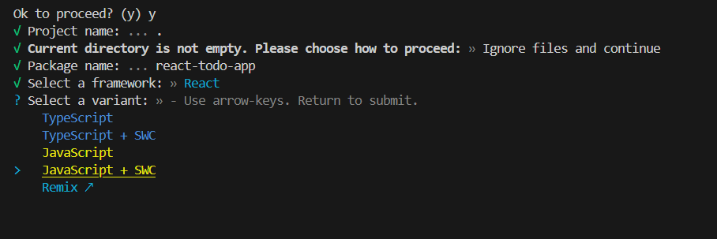
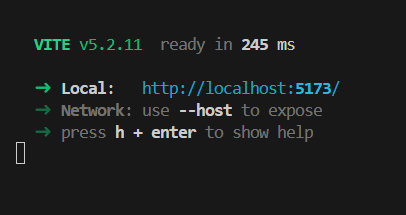
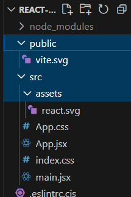

# REACT-todo-app
Learning React with Web Dev Simplified (https://www.youtube.com/watch?v=Rh3tobg7hEo)

## What is react?
- Library for native and web interface
- front end frame work
- features on top of normal javascript

- html looking code is called jsx

## Plan your UI
1. breakdown your code into components like text, video, image, then combine into one app
2. I want my app to look like this 
    *Think about making a sandwich*
    - get a list of ingredients
    - list the instructions 
    *Go to a shop, ask for a sandwich*
    - this is the react way of thinking

## Set up
- npm create vite@latest
- ? Project name: » vite-project (replace w period)
- framework: React
- variant: JavaSript + SWC

- index.html is where our script tag is imported

- in src > assets > main.jsx
  - hooks our html with react code
  - everything inside the app is rendered in 

- in src > assets > App.jsx
    - function that starts w capital letter is a component (ex. function App(){})

- to get started, delete App.css, assets, public

